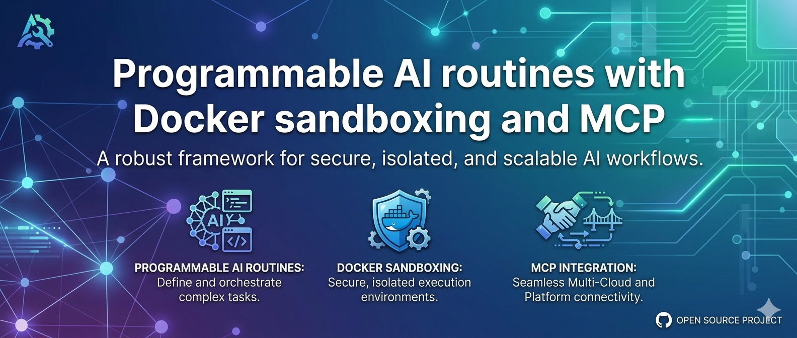

<div align="center">

# Routines

**Open source alternative to Claude Routines**

<p>
  
  
  
  
</p>

[Website](#) · [Features](#-features) · [Screenshots](#-screenshots--demo) · [MCP](#-mcp-tools-30) · [Contributing](#) · [License](#-license)




</div>

---

Run **Claude Code** agents on a schedule. Define recurring tasks with a prompt, a cron expression, and the tools the agent needs — Routines handles the rest. Manage everything from [Claude Code](https://docs.anthropic.com/en/docs/claude-code) or [Codex](https://github.com/openai/codex) through a built-in **MCP server** with 30 tools. Inspired by [Anthropic's built-in routines](https://docs.anthropic.com/en/docs/claude-code/routines), but open source, self-hosted, and fully customizable.

## 🧠 Why Routines?

Most automation tools make you adapt to rigid workflows. Routines adapts to how you already work with Claude.

Define your agent tasks once — give them a prompt, a schedule, and the tools they need — and let them run on autopilot. No manual re-runs, no shell scripts stitched together at midnight, no context-switching between your code and your automation layer.

Whether you're triaging issues daily, generating reports weekly, or running recurring maintenance across projects, Routines gives you a single place where scheduling, agent runtime, execution monitoring, and remote control all work together — locally, securely, through MCP.

Built by Gabriele, a 16-year-old developer from Italy. Read the story →

## ✨ Features

| Category | Features |
|----------|----------|
| ⏰ Scheduling | Cron-based tasks · Per-routine timezone · Enable/disable at task or routine level · Run-now on demand |
| 🤖 Agent Runtime | Model selection (Haiku/Sonnet/Opus) · Tool allowlists · MCP server attachment · Startup scripts |
| 🔌 MCP Control Plane | 30 tools for full CRUD · Create/update/validate/run routines remotely from Claude Code or Codex |
| 📡 HTTP Trigger API | External systems can trigger routines via `POST /api/routines/{name}/run` |
| 🐳 Isolation | Filesystem sandbox by default · Optional Docker runtime · Custom images |
| 🔒 Security | Localhost binding by default · API key auth for network exposure · Agent permission scoping |
| 🛠️ Tooling | Interactive TUI wizard for authoring · Config validation · Schedule preview · Prompt testing |
| 📦 Portability | Import/export routines · Bootstrapped local config · No reliance on `~/.claude*` |

## 📸 Screenshots & Demo

<div align="center">
  
</div>

## 🚀 Quick Start

### 1. Bootstrap

```bash
git clone https://github.com/gabry848/routines.git
cd routines
./bootstrap.sh
```

Installs `uv`, syncs dependencies, and launches interactive onboarding.

### 2. Create your first routine

```bash
cd src
uv run -m cli.create_routine
```

Walks you through naming, scheduling, model selection, and prompt authoring — no JSON editing needed.

### 3. Start the scheduler + MCP server

```bash
cd src
uv run mcp-server
```

Binds to `http://127.0.0.1:8080/mcp`.

### 4. Connect Claude Code / Codex

Add to your client config:

```json
{
  "mcpServers": {
    "scheduler": {
      "url": "http://localhost:8080/mcp"
    }
  }
}
```

Done. You can now create, run, and manage routines directly from your agent.

## 📁 Routine Anatomy

```text
routines/<routine-name>/
├── config.json         # Scheduler + runtime configuration
├── prompt.md           # Agent instructions
├── setup.sh            # Optional pre-execution script
├── env/                # Agent working directory
└── logs/               # Execution logs (auto-created)
```

### Example `config.json`

```json
{
  "scheduler": {
    "enabled": true,
    "timezone": "Europe/Rome",
    "tasks": [
      {
        "task_id": "daily-report",
        "job_name": "Generate Daily Report",
        "enabled": true,
        "schedule": { "type": "cron", "expression": "0 9 * * 1-5" },
        "startup_script": "setup.sh"
      }
    ]
  },
  "model_config": {
    "model": "sonnet",
    "allowed_tools": ["Bash", "Read", "Edit", "Write"]
  }
}
```

## 🔌 MCP Tools (30)

| Category | Tools |
|----------|-------|
| Routine CRUD | `list_routines` · `get_routine` · `add_routine` · `update_routine_config` · `delete_routine` · `rename_routine` · `clone_routine` · `enable_routine` · `disable_routine` |
| Task CRUD | `add_task_to_routine` · `update_task` · `delete_task` · `enable_task` · `disable_task` |
| Import/Export | `export_routine` · `import_routine` |
| Scheduler Control | `reload_routines` · `run_routine_now` · `get_scheduler_status` · `check_filesystem_drift` |
| Monitoring | `list_running_executions` · `get_execution_logs` · `list_execution_history` · `get_last_error` |
| Validation | `validate_routine_config` · `preview_schedule` · `test_startup_script` · `test_prompt` · `list_available_models_tools_plugins` · `suggest_task_id` |

## 🔗 Trigger Routines via HTTP

```bash
curl -X POST http://localhost:8080/api/routines/my-routine/run \
  -H "Authorization: Bearer $SCHEDULER_MCP_API_KEY" \
  -H "Content-Type: application/json" \
  -d '{"task_id":"my-task"}'
```

Set `SCHEDULER_MCP_API_KEY` to enable authentication. If unset, the server is open — safe only on localhost.

## 🛡️ Security

- MCP and trigger API bind to `127.0.0.1` by default
- Set `SCHEDULER_MCP_API_KEY` when exposing beyond localhost
- Agent permission prompts are skipped for unattended runs — treat tool allowlists and MCP exposure as your security boundary
- Filesystem sandbox enabled by default for agent execution

## 🏗️ Typical Use Cases

- Daily repository triage and issue grooming
- Scheduled content drafting or reporting
- Automated research and summarization jobs
- Recurrent maintenance tasks across multiple projects
- Triggering agents with different models, tools, or MCP servers

## 📦 Tech Stack

- **Python** 3.13+ with `uv` dependency management
- **APScheduler** for cron scheduling
- **FastMCP** for the MCP server (30 tools)
- **Textual** for the interactive creation wizard
- **Claude Agent SDK** for agent runtime

## 📄 License

Released under the [MIT License](./LICENSE).

---

<div align="center">
  Built with ❤️ by <strong>Gabriele</strong> · Italy
</div>
